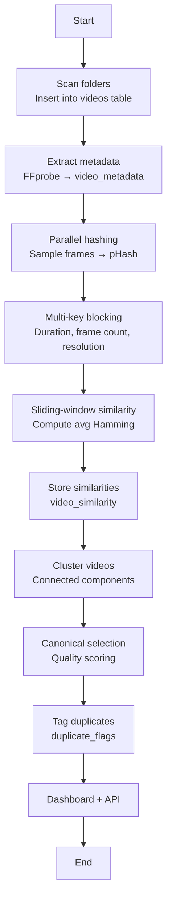

# Video Deduplication System

A scalable, Dockerized, content‑aware video deduplication system that identifies duplicate or near‑duplicate videos—even when they differ in resolution, encoding, duration, or container format.

This system uses:

- Perceptual content hashing (pHash)
- Sliding‑window similarity alignment
- Multi‑key blocking (duration, frame count, resolution class)
- Graph‑based clustering
- Canonical selection based on quality metrics
- SQLite for auditability
- FastAPI for REST API + dashboard
- Parallel hashing for performance
- Ad‑hoc processing endpoint for on‑demand dedupe

---

## ✨ Features

### 🔍 Duplicate Detection
- Robust against:
  - Different resolutions (480p → 4K)
  - Different codecs/containers (MP4, MKV, MOV, WEBM)
  - Re‑encodes and compression artifacts
  - Trims, padding, intros/outros
- Uses perceptual hashing + sliding‑window alignment

### ⚡ Performance
- Multi‑key blocking:
  - Duration ±2s
  - Frame count ±5%
  - Resolution class (SD/HD/FHD/4K)
- Parallel hashing using multiprocessing

### 🧠 Clustering & Canonical Selection
- Graph connected components for clusters
- Canonical chosen by:
  - Resolution
  - Bitrate
  - Codec preference
  - Container preference

### 🌐 REST API
- List clusters
- Inspect cluster details
- Trigger pipeline stages
- Ad‑hoc processing of a single video
- Duplicate proposals (JSON)

### 🖥️ Dashboard
- Cluster browser
- Filters (min size, search)
- Cluster detail pages
- Proposed duplicate cleanup view

### 🐳 Dockerized
- Worker container for pipeline
- API container for dashboard + REST

---

## 📂 Directory Structure
        app/
        ├── src/
        │    ├── api_app.py 
        │    ├── adhoc.py 
        │    ├── canonical.py 
        │    ├── cluster.py 
        │    ├── compute_hashes.py 
        │    ├── extract_metadata.py 
        │    ├── main.py 
        │    ├── pipeline.py 
        │    ├── report_clusters.py 
        │    ├── scan_folders.py 
        │    ├── similarity.py 
        │    ├── templates/ 
        │    │    ├── dashboard.html 
        │    │    ├── cluster.html 
        │    │    └── proposals.html 
        ├── schema.sql 
        ├── requirements.txt 
        └── Dockerfil


---

## 🧱 System Architecture

```markdown
```mermaid
flowchart TD

    subgraph Worker[Worker Container]
        A1[scan_folders.py<br/>Discover video files] --> A2
        A2[extract_metadata.py<br/>FFprobe metadata] --> A3
        A3[compute_hashes.py<br/>Parallel pHash extraction] --> A4
        A4[similarity.py<br/>Blocking + sliding window] --> A5
        A5[cluster.py<br/>Graph connected components] --> A6
        A6[canonical.py<br/>Quality-based canonical selection]
    end

    subgraph DB[(SQLite Database)]
        V[videos]
        M[video_metadata]
        H[video_hashes]
        S[video_similarity]
        C[duplicate_clusters]
        K[canonical_videos]
        D[duplicate_flags]
    end

    Worker --> DB

    subgraph API[API + Dashboard Container]
        R1[REST API<br/>FastAPI]
        R2[Dashboard<br/>Jinja2 Templates]
        R3[Ad-hoc Processing]
        R4[Pipeline Trigger Endpoints]
    end

    API --> DB
```


## 🔄 Pipeline Flow

```markdown



## 🚀 Running the System

### Build & start

```bash
docker compose up --build
```

### Run full pipeline manually
```bash
docker compose run --rm deduper all
```

### Run individual stages
```bash
docker compose run --rm deduper scan
docker compose run --rm deduper meta
docker compose run --rm deduper hash
docker compose run --rm deduper sim
docker compose run --rm deduper cluster
docker compose run --rm deduper canon
```

## 🌐 API Endpoint

### Clusters
- GET /clusters
- GET /clusters/{id}

### Videos
- GET /videos/{video_id}

### Proposals
- GET /proposals.json

### Pipeline Triggers
- POST /run/{stage} \
    Stages: scan, meta, hash, sim, cluster, canon, all

### Ad‑Hoc Processing
- POST /adhoc \
{ "path": "/videos/newfile.mp4" }

## 🖥️ Dashboard
- / — cluster list + filters
- /cluster/{id} — cluster detail
- /proposals — duplicate cleanup proposals

## 📜 License


